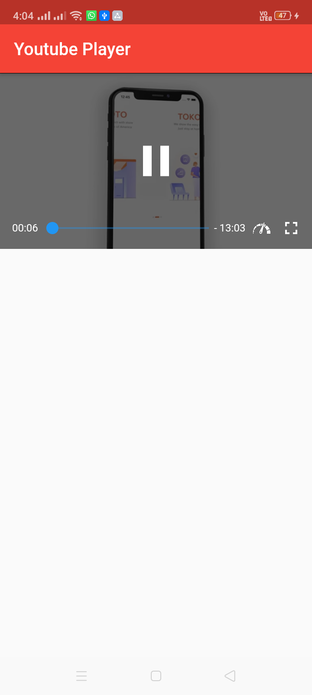

# YouTube Playing

This project is for playing video in YouTube through in Flutter coding.

# Reqirements:-
+ Plugins :- [YouTube Player Flutter](https://pub.dev/packages/youtube_player_flutter).
+ Android :- minsdkversion must be at least 17.
+ iOS :- iOS->Runner->Info.plist add [<key>io.flutter.embedded_views_preview</key>] line.

##### If you want to play YouTube videos through API then please refer [Flutter YouTube API and Video Player Tutorial](https://www.youtube.com/watch?v=feQhHStBVLE&list=PLzOt3noWLMthJKm8SJl2zmUlJiZp7fzo7&index=4)   :slightly_smiling_face:

## Screenshot :-

